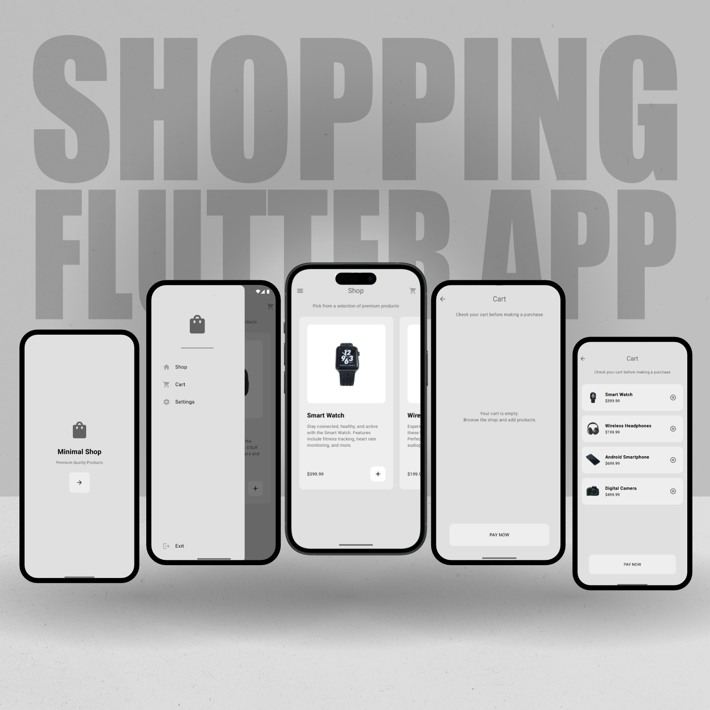
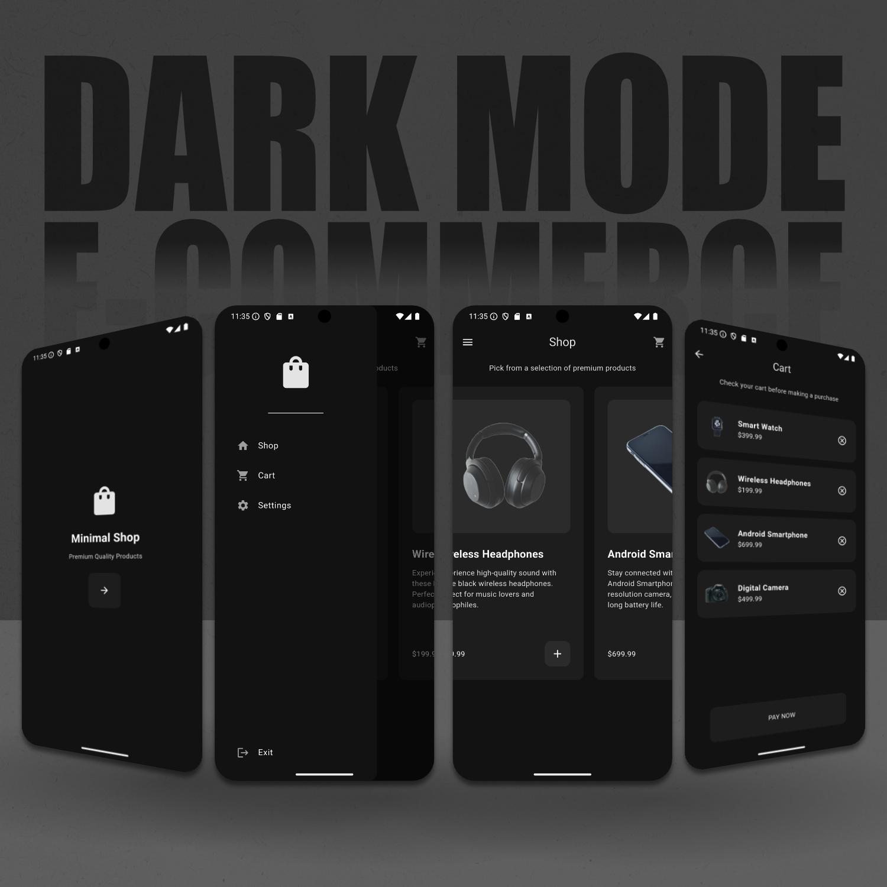

# Flutter E-commerce App

A simple, minimalist e-commerce app made with Flutter. Features include browsing through products and saving and removing items from the cart.

 

## Screenshots

## Flutter Resources

A few resources to get you started if this is your first Flutter project:

- [Lab: Write your first Flutter app](https://docs.flutter.dev/get-started/codelab)
- [Cookbook: Useful Flutter samples](https://docs.flutter.dev/cookbook)

For help getting started with Flutter development, view the
[online documentation](https://docs.flutter.dev/), which offers tutorials,
samples, guidance on mobile development, and a full API reference.

## Credits

The example product images used in this project are from Unsplash.com:

- [Apple Watch](https://unsplash.com/photos/apple-watch-at-358-HM-Y497t5CU)
- [Black Wireless Headphones](https://unsplash.com/photos/black-wireless-headphones-between-apple-keyboard-and-apple-magic-mouse-on-white-surface-YDZPdqv3FcA)
- [Black Android Smartphone](https://unsplash.com/photos/black-android-smartphone-on-white-surface-JZrebB7aHyQ)
- [Black Canon EOS Rebel Series DSLR Camera](https://unsplash.com/photos/black-canon-eos-rebel-series-dslr-camera-W2Dta_Yiwfw)
